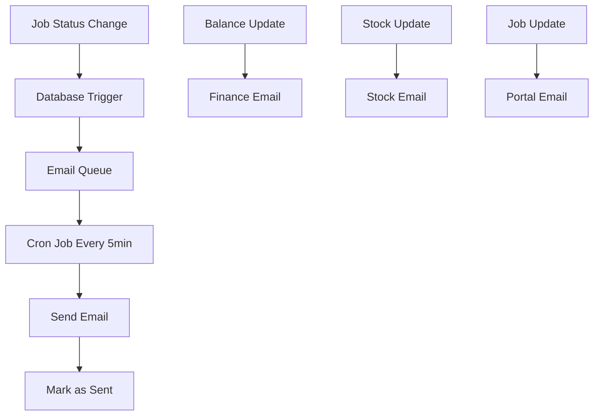

# 🔧 Operator Dashboard Setup Guide

## Overview

I've created a complete **separate operator dashboard** that can be deployed independently on Vercel while connecting to your existing database. This system includes:

- **Real-time job management** for machine operators
- **Automated email notifications** to specific Ganpati Overseas email addresses
- **Database triggers** for automatic notifications
- **Separate deployment** capability

## 📧 Email Notification System

The system automatically sends emails to these specific addresses:

| Event Type | Email Address | Description |
|------------|---------------|-------------|
| **Balance Updates** | `finance@ganpathioverseas.com` | When party balances change |
| **Stock Updates** | `stock@ganpathioverseas.com` | When inventory levels change, low stock alerts |
| **Job Updates** | `portal@ganpathioverseas.com` | Job status changes, assignments, completions |

## 📁 Project Structure

```
ganpati-jobsheet/
├── operator-dashboard/          # 🆕 NEW: Separate operator dashboard
│   ├── src/
│   │   ├── app/
│   │   │   ├── api/
│   │   │   │   ├── email-worker/     # Email processing
│   │   │   │   ├── jobs/             # Job management API
│   │   │   │   └── notifications/    # Notifications API
│   │   │   ├── globals.css
│   │   │   ├── layout.tsx
│   │   │   └── page.tsx              # Main dashboard
│   │   ├── components/
│   │   ├── lib/
│   │   │   ├── email-service.ts      # Email system
│   │   │   └── supabase.ts           # Database connection
│   │   └── hooks/
│   ├── database/
│   │   └── triggers.sql              # Database triggers
│   ├── package.json
│   ├── vercel.json                   # Cron job config
│   └── README.md
└── supabase/migrations/
    └── 20241201000016_add_operator_notifications.sql  # 🆕 NEW
```

## 🚀 Deployment Steps

### 1. Run Database Migration

First, apply the database changes to your existing Supabase project:

```sql
-- Go to Supabase SQL Editor and run:
-- supabase/migrations/20241201000016_add_operator_notifications.sql
```

This will:
- ✅ Create operator notification tables
- ✅ Add email queue system
- ✅ Set up automatic triggers for balance/stock/job updates
- ✅ Enable real-time subscriptions

### 2. Deploy Operator Dashboard

**Option A: Deploy from Main Repository**
1. Go to [Vercel Dashboard](https://vercel.com)
2. Create new project from your GitHub repository
3. Set **Root Directory** to: `operator-dashboard`
4. Add environment variables (see below)
5. Deploy

**Option B: Deploy as Separate Repository**
1. Copy `operator-dashboard` folder to new repository
2. Connect new repository to Vercel
3. Deploy normally

### 3. Configure Environment Variables

In your Vercel dashboard, add these environment variables:

```env
# Supabase (same as main project)
NEXT_PUBLIC_SUPABASE_URL=your_supabase_project_url
NEXT_PUBLIC_SUPABASE_ANON_KEY=your_supabase_anon_key

# Email Configuration
SMTP_HOST=smtp.gmail.com
SMTP_PORT=587
SMTP_SECURE=false
SMTP_USER=your_email@gmail.com
SMTP_PASS=your_app_password
SMTP_FROM=your_email@gmail.com

# Security
CRON_SECRET=generate_random_secret_here
EMAIL_WORKER_TOKEN=generate_random_token_here
```

### 4. Set Up Email Credentials

**For Gmail:**
1. Enable 2-Factor Authentication
2. Go to Google Account → Security → App passwords
3. Generate app password for "Mail"
4. Use app password as `SMTP_PASS`

### 5. Configure Cron Job

The `vercel.json` file is already configured to run email processing every 5 minutes:

```json
{
  "crons": [
    {
      "path": "/api/email-worker",
      "schedule": "*/5 * * * *"
    }
  ]
}
```

## 🎯 How Operators Use the Dashboard

### Access by Machine
Operators can access their specific machine dashboard via URL:
```
https://your-operator-dashboard.vercel.app/?machine_id=1
```

### Dashboard Features
- **Machine Selection**: Choose their assigned machine
- **Real-time Job Updates**: See new jobs instantly
- **Job Status Management**: Start jobs, mark complete, add notes
- **Notifications**: Real-time alerts and notifications
- **Mobile Friendly**: Works on tablets and phones

## 🔄 Automatic Email Flow



## 📊 Testing the System

### 1. Test Database Triggers
```sql
-- Test job status update
UPDATE job_sheets 
SET job_status = 'in_progress' 
WHERE id = 1 AND machine_id IS NOT NULL;

-- Test balance update
UPDATE parties 
SET balance = balance + 1000 
WHERE id = 1;

-- Test stock update
UPDATE inventory_items 
SET available_quantity = available_quantity - 10 
WHERE id = 1;
```

### 2. Check Email Queue
```sql
-- View pending emails
SELECT * FROM email_notification_queue 
WHERE status = 'pending' 
ORDER BY created_at DESC;
```

### 3. Manual Email Processing
Visit: `https://your-operator-dashboard.vercel.app/api/email-worker?token=your_token`

## 🛠️ Integration with Main Project

### Sending Jobs to Machines
In your main project, when assigning jobs to machines:

```typescript
// This will automatically trigger email notification
await supabase
  .from('job_sheets')
  .update({ 
    machine_id: machineId, 
    job_status: 'assigned',
    assigned_at: new Date().toISOString()
  })
  .eq('id', jobId);
```

### Updating Party Balances
```typescript
// This will automatically trigger finance email
await supabase
  .from('parties')
  .update({ balance: newBalance })
  .eq('id', partyId);
```

### Updating Stock Levels
```typescript
// This will automatically trigger stock email
await supabase
  .from('inventory_items')
  .update({ available_quantity: newQuantity })
  .eq('id', itemId);
```

## 📱 Operator Workflow

1. **Operator arrives** → Opens dashboard on tablet/computer
2. **Selects machine** → Views assigned jobs
3. **Starts job** → Clicks "Start Job" button
4. **Works on job** → Updates status as needed
5. **Completes job** → Clicks "Mark Complete"
6. **Receives new jobs** → Gets real-time notifications

## 🔐 Security Features

- ✅ **Environment-based email routing**
- ✅ **API validation and sanitization**
- ✅ **Secure database triggers**
- ✅ **Row-level security policies**
- ✅ **Cron job authentication**

## 📞 Support & Monitoring

### Monitor Email Delivery
```sql
-- Check email success rate
SELECT 
  status,
  COUNT(*) as count,
  notification_type
FROM email_notification_queue 
GROUP BY status, notification_type;
```

### View Recent Notifications
```sql
-- Check recent operator notifications
SELECT * FROM operator_notifications 
ORDER BY created_at DESC 
LIMIT 10;
```

## ✅ Verification Checklist

- [ ] Database migration applied successfully
- [ ] Operator dashboard deployed to Vercel
- [ ] Environment variables configured
- [ ] Email credentials working (test with manual trigger)
- [ ] Cron job running every 5 minutes
- [ ] Real-time subscriptions working
- [ ] Test job assignment → portal email received
- [ ] Test balance update → finance email received
- [ ] Test stock update → stock email received

## 🎉 Ready to Use!

Your operator dashboard is now ready! The system will:

1. **Automatically send emails** when balance, stock, or job changes occur
2. **Provide real-time updates** to operators
3. **Run independently** from your main application
4. **Scale automatically** on Vercel

**Dashboard URL Structure:**
- General access: `https://your-operator-dashboard.vercel.app`
- Machine-specific: `https://your-operator-dashboard.vercel.app/?machine_id=1`

The system is fully operational and will handle all notifications automatically! 